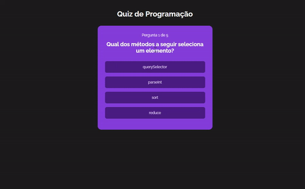
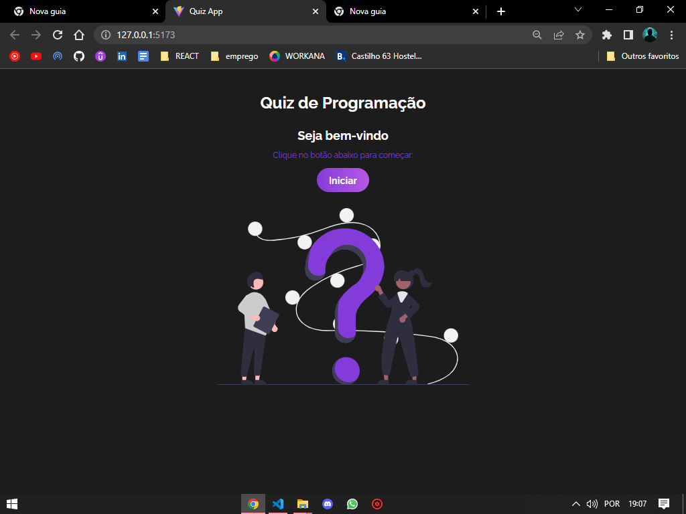
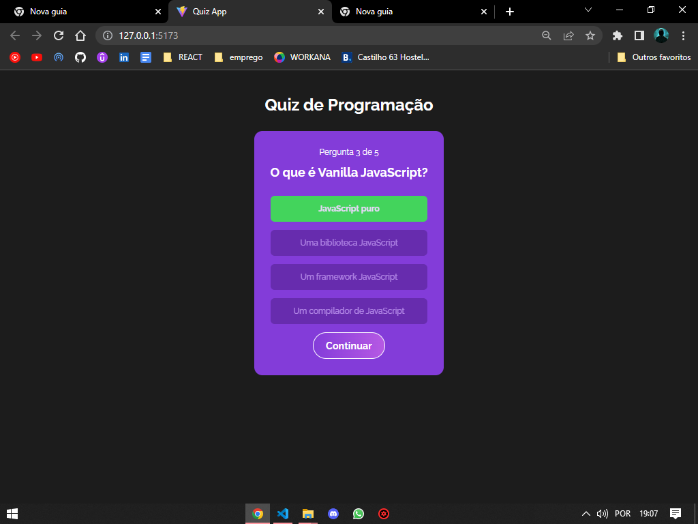
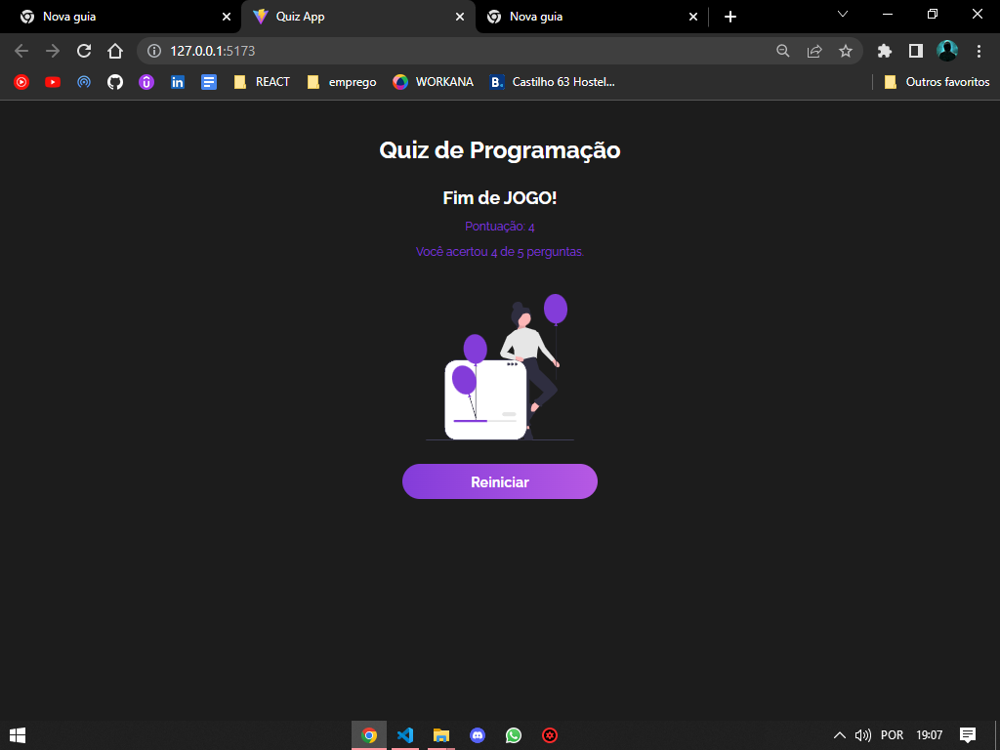

# ❗QUIZ de JAVASCRIPT.

WebApp de um joguinho de perguntas e repostas sobre JavaScript, para testar seus conhecimentos da linguagem.👀

obs: A cada novo game, as perguntas são embaralhadas, para que não seja detectado um padrão.

## Técnico👨🏻‍💻

Tecnologias utilizadas: HTML/CSS, JS, ReactJS e ViteJS

Página inicial:🏠

Página de Perguntas:❓

Tela Final com resultados!♻

